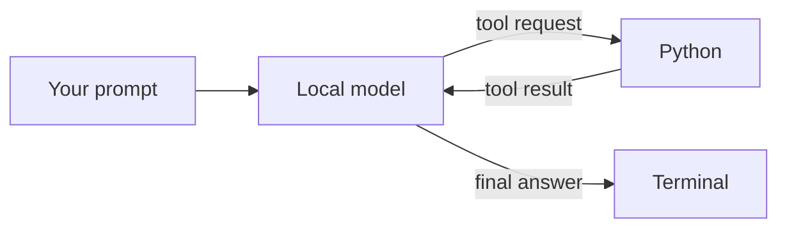

# Build an AI Agent From Scratch

Build a real AI agent one piece at a time with Python, Ollama, and a local language model.

This course begins with one model request and ends with a controlled agent that can choose tools, inspect results, recover from errors, and ask before it changes a file. No agent framework hides the process.

After downloading or cloning the repository, open [`course/index.html`](course/index.html) in your browser to use the interactive dashboard. To publish it, follow [`UPLOAD_WITH_GITHUB_DESKTOP.md`](UPLOAD_WITH_GITHUB_DESKTOP.md); the Pages address will end in `/ai-agent-from-scratch/course/`.

## What you will build



## The six parts

| Part | Build | Main idea |
| --- | --- | --- |
| [1. Connect the model](parts/01-connect-model/README.md) | Send a message from Python to the local model | A model call |
| [2. Add the first tool](parts/02-first-tool/README.md) | Let the model request the computer's current time | One controlled action |
| [3. Build the loop](parts/03-agent-loop/README.md) | Continue until the model returns a final answer | Repeated decisions |
| [4. Add multiple tools](parts/04-multiple-tools/README.md) | Time, calculation, and word-count tools | Tool selection and arguments |
| [5. Recover from errors](parts/05-error-recovery/README.md) | Return useful failures to the model | Correction instead of crashing |
| [6. Add permissions and limits](parts/06-permissions-and-limits/README.md) | Safe file access, approval, and step limits | Control what may actually happen |

Every part contains:

- a short lesson;
- valid starter code with focused TODOs;
- a complete solution;
- a challenge that changes one idea at a time.

The matching short-form video copy is in [`SOCIAL_CAPTIONS.md`](SOCIAL_CAPTIONS.md).

## Quick start

### 1. Install the requirements

- Python 3.10 or newer
- [Ollama](https://ollama.com/)

The course uses `gpt-oss:20b`. OpenAI's local Ollama guide recommends at least 16 GB of VRAM or unified memory for this model. CPU offloading can work, but it will be slower.

### 2. Download the model

```bash
ollama pull gpt-oss:20b
```

Make sure Ollama is running before starting a lesson.

### 3. Create a Python environment

```bash
python -m venv .venv
```

Activate it:

```bash
# macOS or Linux
source .venv/bin/activate

# Windows PowerShell
.venv\Scripts\Activate.ps1
```

Install the packages:

```bash
pip install -r requirements.txt
```

### 4. Run Part 1

```bash
python parts/01-connect-model/solution/agent.py
```

Then open [START_HERE.md](START_HERE.md) and follow the course in order.

## How the folders work

```text
ai-agent-from-scratch/
├── course/                     interactive browser dashboard
├── parts/
│   ├── 01-connect-model/
│   │   ├── starter/agent.py
│   │   ├── solution/agent.py
│   │   ├── README.md
│   │   └── challenge.md
│   └── ...
├── resources/                  glossary and tool-call cheat sheet
├── tests/                      offline course checks
└── README.md
```

Start each part in its `starter` folder. Compare your result with `solution` only after you have tried the TODOs.

## Run the checks

The tests do not call the model or require Ollama. They verify the course structure and the local helper functions.

```bash
pytest
```

## Local connection settings

Each solution keeps the connection values near the top of `agent.py`:

```python
MODEL = "gpt-oss:20b"
BASE_URL = "http://localhost:11434/v1"
```

The client also receives `api_key="ollama"`. This is a dummy value required by the client; the request is sent to Ollama on your computer.

## Official reference

The local connection and tool-calling structure follow OpenAI's guide: [How to run gpt-oss locally with Ollama](https://developers.openai.com/cookbook/articles/gpt-oss/run-locally-ollama).
